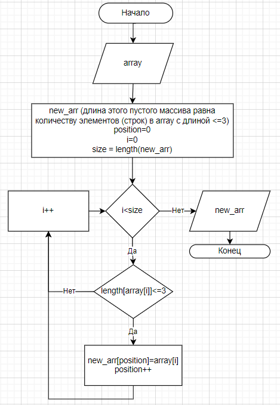

# Итоговая проверочная работа

    Задание: необходимо написать программу, которая из имеющегося массива строк формирует массив строк, длина которого меньше либо равна 3.

## **Блок-схема основной части алгоритма:**

## **Описание решения**

Сам алгоритм, который из исходного массива строк будет формировать массив строк с длиной <= 3, разбит на 2 этапа. Сначала программа подсчитывает количество элементов (строк) массива с подходящей длиной. Затем программа создает массив из подходящих строк исходного массива. Для выполнения этих действий были созданы 2 отдельные функции.

Функция **CountSuitableElements** - принимает на вход одномерный массив из строк и возвращает количество элементов в этом массиве, длина которых  <= 3. С помощью цикла "for" функция пробегает по всем элементам массива с нулевого до последнего и, проверяя условие "длина строки <= 3", увеличивает счетчик (count) на 1, если условие выполняется. Потом возвращается значение счетчика.

Функция **ArrayOfSuitableElements** - принимает на вход одномерный массив из строк и создает на его основе новый массив. Внутри функции создаются локальные переменные:
- new_arr - одномерный массив из строк. Изначально он пустой. Длина, задаваемая при его создании, солучается вызовом функции CountSuitableElements.
- position - изначально равна 0. Используется как индекс при добавлении в new_arr подходящих строк.

Через цикл "for" функция ArrayOfSuitableElements пробегает по всем элементам исходного массива от нулевого до последнего и проверяет для этих элементов условие "длина строки <= 3". На каждой итерации, на которой условие верно, значение элемента исходного массива, для которого проверялось условие, присваивается элементу масcива new_arr с индексом position. Также на этой итерации значение переменной position увеличивается на 1. По окончании цикла функция возвращает массив new_arr. 

Также в программе рализована функция **PrintArry**. Она принимает на вход одномерный массив строк и печатает его.

После реализации функций идет код, который выполняет программу:

1. Для удобства отчищается консоль.
2. Задается первоначальный массив. 
3. Печатается исходный массив функцией PrintArray.
4. Печатается символ "->".
5. Вызывается функция ArrayOfSuitableElements для исходного массива и печатается ее результат функцией PrintArray.

